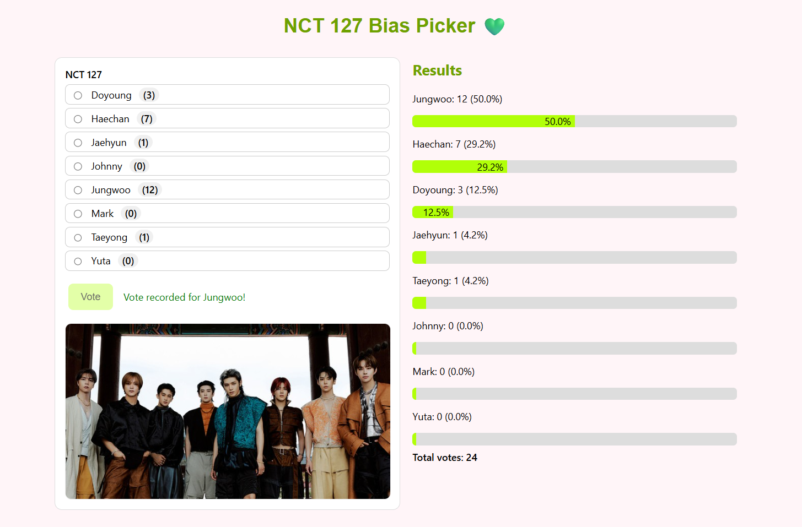

# K-Pop Bias Picker (Serverless)

A tiny serverless app to vote your bias and see live results.

## Live Demo
HTTPS (CloudFront): https://d1zbt2qlft7m49.cloudfront.net
HTTP (S3 website, fallback/testing): http://bias-picker-briana-2025.s3-website-us-east-1.amazonaws.com/

## Architecture
- Frontend: Static HTML/JS on S3 static website, served via CloudFront (HTTPS)
- Backend: API Gateway → Lambda (Python) → DynamoDB (votes table)

## Endpoints
- `GET /groups/{groupId}`
- `POST /groups/{groupId}/vote`
- `GET /groups/{groupId}/results`

## Deploy - Frontend (S3)
1. Create S3 bucket
- Static website hosting: Enable, Index document: index.html, Error document: index.html (for simple routing fallbacks).
- Block public access: OFF (disabled) for this bucket.
2. Bucket policy (public read of site files):
```json
{
    "Version": "2012-10-17",
    "Statement": [
        {
        "Sid": "PublicReadGetObject",
        "Effect": "Allow",
        "Principal": "*",
        "Action": "s3:GetObject",
        "Resource": "arn:aws:s3:::bias-picker-briana-2025/*"
        }
    ]
} 
```
3. Upload files
- index.html at the bucket root
- Assets in images/ (e.g., images/nct127-factcheck.jpg)
4. Website endpoint (HTTP):
http://bias-picker-briana-2025.s3-website-us-east-1.amazonaws.com/ 

## Hosting — HTTPS via CloudFront
1. Create a distribution
- Origin: your S3 website endpoint (must be s3-website-...amazonaws.com)
- Origin protocol policy: HTTP only
- Origin access: Public (no OAC/OAI for website endpoints)
2. Default behavior
- Viewer protocol policy: Redirect HTTP → HTTPS
- Allowed methods: GET, HEAD
- Cache policy: CachingOptimized
- Compress objects: On
3. General/Settings
- Default root object: index.html
- Certificate: Default CloudFront certificate (*.cloudfront.net)
- Alternate domain names (CNAMEs): (leave blank unless you own a domain)
4. Distribution domain (live link):
https://d1zbt2qlft7m49.cloudfront.net
5. Cache invalidation:
CloudFront → Invalidations → Create → Path: /*

## CORS / Lambda Environment
Set your Lambda environment variable so the browser is allowed to call the API from your site’s origin:
ALLOWED_ORIGIN = https://d1zbt2qlft7m49.cloudfront.net
If you develop locally with VS Code Live Server, you can temporarily set
ALLOWED_ORIGIN = http://127.0.0.1:5500 while testing, then switch it back.

## Local Dev Notes
- Keep assets in images/ and reference with relative paths like images/nct127-factcheck.jpg.
- If your index.html lives in a subfolder during local dev, ensure paths resolve (e.g., with <base href="../">) or serve from the project root.
- Fits AWS Free Tier for light traffic; $1 Budget alert configured.

## Troubleshooting
- Opening /images/foo.jpg shows the app instead of the image: the key is missing → S3 website serves the error document (index.html). Upload to the exact path (case-sensitive).
- 403/AccessDenied at CloudFront: origin is the bucket API endpoint; switch it to the website endpoint and set Origin access = Public.
- CORS error on vote: ALLOWED_ORIGIN must exactly match your site’s origin (including https).
- Changes not showing: create a CloudFront invalidation for /*.

## Flowchart


## Demo
Here’s the website:

